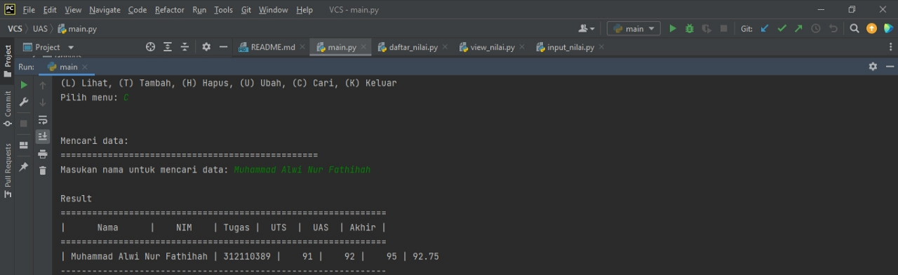

# UAS
# Pertemuan 16 (UAS)


## Penjelasan

>daftar_nilai.py berisi modul untuk: tambah_data, ubah_data, hapus_data, dan cari_data.
## Tambah Data

* Fungsi `tambah_data()` untuk menambahkan data mahasiswa seperti nama, nim, nilai tugas, nilai uts dan nilai uas dengan menggunakan fungsi `input_nama()`, `input_nim()`, `input_ntugas()`, `input_nuts()`, `input_nuas()`. Data yang diinput akan masuk ke dalam direktori `data_mahasiswa = {}`.

```python
   def tambah_data():
    global data
    ulangi = 'y'
    while ulangi =='y':
        nama = input_nama()
        nim = input_nim()
        nilai_tugas = input_ntugas()
        nilai_uts = input_nuts()
        nilai_uas = input_nuas()
        nilai_akhir = nakhir()
        data[nama] = [nama, nim, nilai_tugas, nilai_uts, nilai_uas, nilai_akhir]
        ulangi = (input('tambah data?(y/t) : '))

        if ulangi == 't':
            print('\nData berhasil di tambah!')
            return data
```

## Output Tambah Data


## Ubah Data

* Fungsi `ubah_data()` untuk mengubah data mahasiswa berdasarkan nama, lalu masukkan data yang ingin diubah.
* Jika sebelumnya belum menginput data, maka akan memanggil fungsi `no_data`.

```python
    def ubah_data():
    if len(data_mahasiswa) <= 0:
        no_data()
    else:
        print("UBAH DATA")
        print("-----------")
        nama = input("Nama Anda\t: ")
        if nama in data_mahasiswa.keys():
            nim = int(indef ubah_data():
    nama = input("Masukan nama untuk mengubah data: ")
    if nama in data.keys():
        print("\nMau mengubah apa?")
        sub_data = input("(Semua), (NIM), (Tugas), (UTS), (UAS) : ")
        if sub_data.lower() == "semua":
            print("==========================")
            print("Ubah data {}.".format(nama))
            print("==========================")
            data[nama][1] = input("Ubah NIM:")
            data[nama][2] = int(input("Ubah Nilai Tugas: "))
            data[nama][3] = int(input("Ubah Nilai UTS: "))
            data[nama][4] = int(input("Ubah Nilai UAS: "))
            data[nama][5] = data[nama][2] *30/100 + data[nama][3]*35/100 + data[nama][4] *35/100
            print("\nBerhasil ubah data!")

        elif sub_data.lower() == "nim":
            data[nama][1] = input("\nNIM:")
            print('\nData berhasil di ubah!')
        elif sub_data.lower() == "tugas":
            data[nama][2] = int(input("\nNilai Tugas: "))
            data[nama][5] = data[nama][2] *30/100 + data[nama][3]*35/100 + data[nama][4] *35/100
            print('\nData berhasil di ubah!')
        elif sub_data.lower() == "uts":
            data[nama][3] = int(input("\nNilai UTS: "))
            data[nama][5] = data[nama][2] *30/100 + data[nama][3]*35/100 + data[nama][4] *35/100
            print('\nData berhasil di ubah!')
        elif sub_data.lower() == "uas":
            data[nama][4] = int(input("\nNilai UAS: "))
            data[nama][5] = data[nama][2] *30/100 + data[nama][3]*35/100 + data[nama][4] *35/100
            print('\nData berhasil di ubah!')
        else:
            print("\nMenu tidak ditemukan.")

    else:
        print("'{}' Tidak ditemukan.".format(nama))put("NIM Mahasiswa\t: "))
            tugas = int(input("Nilai Tugas\t: "))
            uts = int(input("Nilai UTS\t: "))
            uas = int(input("Nilai UAS\t: "))
            nilai_akhir = (tugas*30/100)+(uts*35/100)+(uas*35/100)
            data_mahasiswa[nama] = [nim, tugas, uts, uas, nilai_akhir]
            print()
```

## Output Ubah Data


## Hapus Data

* Fungsi `hapus_data()` untuk menghapus data mahasiswa berdasarkan nama.
* Jika sebelumnya belum menginput data, maka akan memanggil fungsi `no_data`.

```python
    def hapus_data():
    nama = input("Masukan nama untuk menghapus data : ")
    if nama in data.keys():
        del data[nama]
        print("\nData '{}' berhasil dihapus.".format(nama))
    else:
        print("'{}' Tidak ditemukan.".format(nama))
```

## Output Hapus Data


## Cari Data

* Fungsi `cari_data()` untuk mencari data mahasiswa berdasarkan nama.

```python
    def cari_data():
    print("Mencari data: ")
    print("=================================================")
    nama = input("Masukan nama untuk mencari data: ")
    print('\nResult')
    print("==============================================================")
    print("|      Nama      |    NIM    | Tugas |  UTS  |  UAS  | Akhir |")
    print("==============================================================")
    if nama in data.keys():
        print("| {0:14} | {1:9} | {2:5} | {3:5} | {4:5} | {5:5}"
            .format(nama, data[nama][1], data[nama][2], data[nama][3], data[nama][4], data[nama][5]))
        print('--------------------------------------------------------------')
    else:
        print("'{}' Tidak ditemukan.".format(nama))
```

## Output Cari Data



>view_nilai.py berisi modul untuk: cetak_daftar_nilai, cetak_hasil_pencarian
## Lihat Data

* Fungsi `lihat_data()` untuk mencetak atau melihat data mahasiswa yang sudah diinput sebelumnya.
* Jika belum menginput data, maka akan memanggil fungsi `no_data()`.

```python
    def lihat_data():
    print("Daftar Nilai:")
    print("===================================================================")
    print("| No |      Nama      |    NIM    | Tugas |  UTS  |  UAS  | Akhir |")
    print("===================================================================")
    if data.keys():
        no = 1
        for tabel in data.values():
            print("| {0:2} | {1:14} | {2:9} | {3:5} | {4:5} | {5:5} | {6:5} |".format
                (no, tabel[0], tabel[1], tabel[2], tabel[3], tabel[4], tabel[5]))
            print('-------------------------------------------------------------------')
            no += 1
    else:
        print("=========================TIDAK ADA DATA============================")
        print("===================================================================")
```

## Output Lihat Data


>input_nilai.py berisi modul untuk: input_data yang meminta pengguna memasukkan data.
## Input Data

* Untuk menginput data yang terdiri dari beberapa fungsi yaitu `input_nama()`, `input_nim()`, `input_ntugas()`, `input_nuts()`, `input_nuas()`. 

```python
def input_nama():
    print("\nMasukkan data mahasiswa")
    global nama
    nama = input("\nNama: ")
    return nama


def input_nim():
    global nim
    nim = input("NIM: ")
    return nim


def input_ntugas():
    global nilai_tugas
    nilai_tugas = int(input("Masukkan nilai tugas: "))
    return nilai_tugas


def input_nuts():
    global nilai_uts
    nilai_uts = int(input("Masukkan nilai UTS: "))
    return nilai_uts


def input_nuas():
    global nilai_uas
    nilai_uas = int(input("Masukkan nilai UAS: "))
    return nilai_uas


# Nilai akhir
def nakhir():
    global nilai_akhir
    nilai_akhir = (nilai_tugas)*30/100 + (nilai_uts)*35/100 + (nilai_uas)*35/100
    return nilai_akhir
```

>main.py berisi program utama (menu pilihan yang memanggil semua menu yang ada)
## Menu

* Import package view dan model agar dapat dieksekusi di `main.py`.

```python
    from model.daftar_nilai import *
    from view.view_nilai import *
```
* Terdapat pilihan menu yang terdiri dari tambah data, ubah data, lihat data, hapus data, cari data dan menu untuk keluar dari program.

```python
    while True:
    print("\n")
    menu = input("(L) Lihat, (T) Tambah, (H) Hapus, (U) Ubah, (C) Cari, (K) Keluar\nPilih menu: ")
    print("\n")

    # menu
    if menu.lower() == 't':
        tambah_data()

    elif menu.lower() == 'c':
        cari_data()

    elif menu.lower() == 'l':
        lihat_data()

    elif menu.lower() == 'u':
        ubah_data()

    elif menu.lower() == 'h':
        hapus_data()

    # Keluar
    elif menu.lower() == 'k':
        break

    else:
        print("Ada yang salah, Silahkan cek kembali.")
```